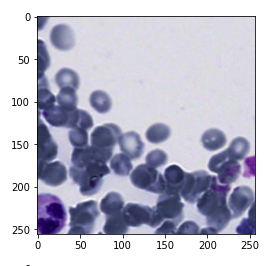

# Histologic-Image-Processing

This code is useful for handling high resolution and large-sized histologic images. It preprocesses the images by using the patchify library to divide the images into smaller patches, and then applies data augmentation using the albumentations library. This allows the processed images to be loaded into deep learning models that are designed to work with small images such as 256x256.


This code is a python script that performs several image processing tasks using the libraries numpy, patchify, PIL, matplotlib, sklearn, skimage, albumentations, and cv2. The script first imports all the necessary libraries.

The script defines several functions that perform different tasks:

- The `augment_image` function takes an image as input and applies random cropping, horizontal flipping, and random brightness/contrast changes to the image using the albumentations library.
- The `read_image` function takes a path to an image file as input and returns the image data as a numpy array.
- The `extract_patches` function takes an image as input and extracts non-overlapping patches of a specified size and step.
- The `binary_img` function takes a random patch as input and returns a binary image obtained by applying the Otsu thresholding method to the grayscale version of the patch.
- The `display_Random_patches` function takes a list of patches as input and displays one patch randomly.
- The `Output_Random_patches` function takes a list of patches as input and returns a random patch from the list of patches.
- The `display_Allpatches` function takes a list of patches as input and displays them as a grid of images.

In the last part of the script, the script reads an image from the specified path, extracts patches from the image, and then displays a random patch from the list of patches. The script also prints the shape of the patches list.

# Installation

To install the required libraries, please use the following commands:

```!pip install patchify```

```!pip install albumentations```




